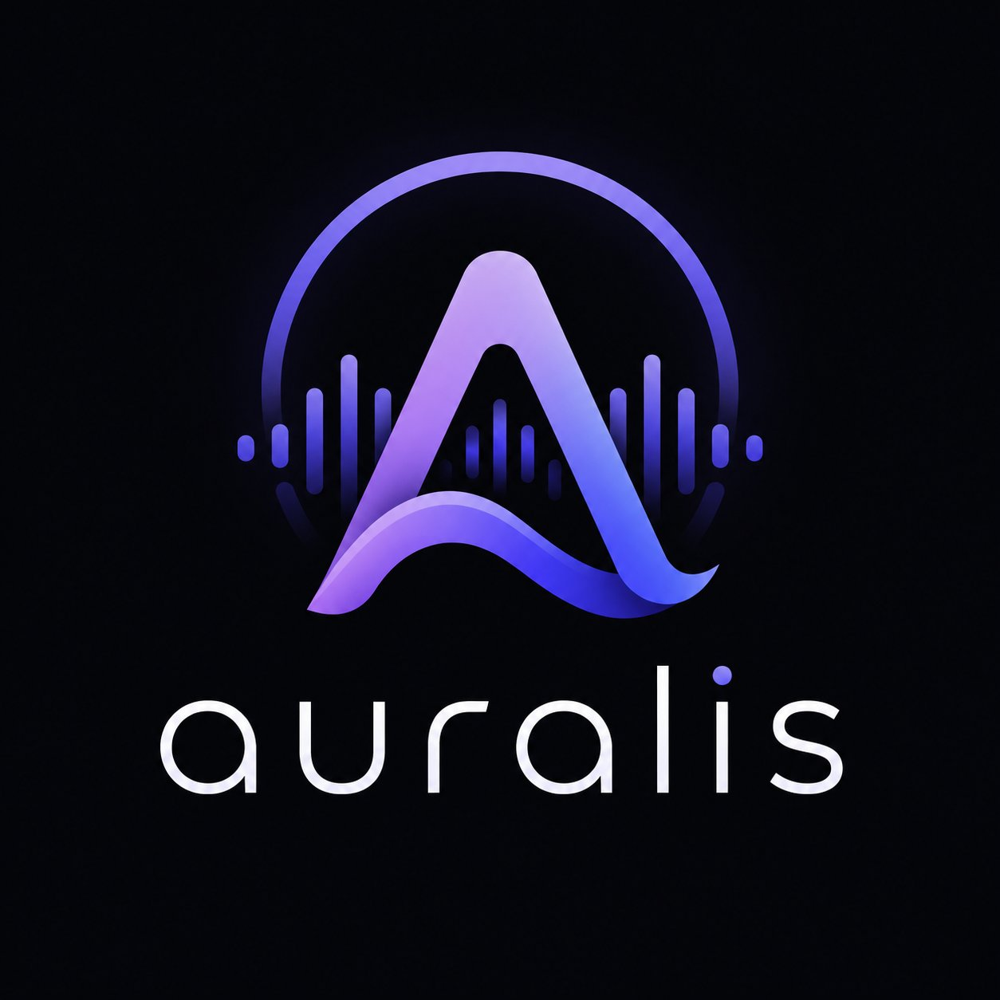
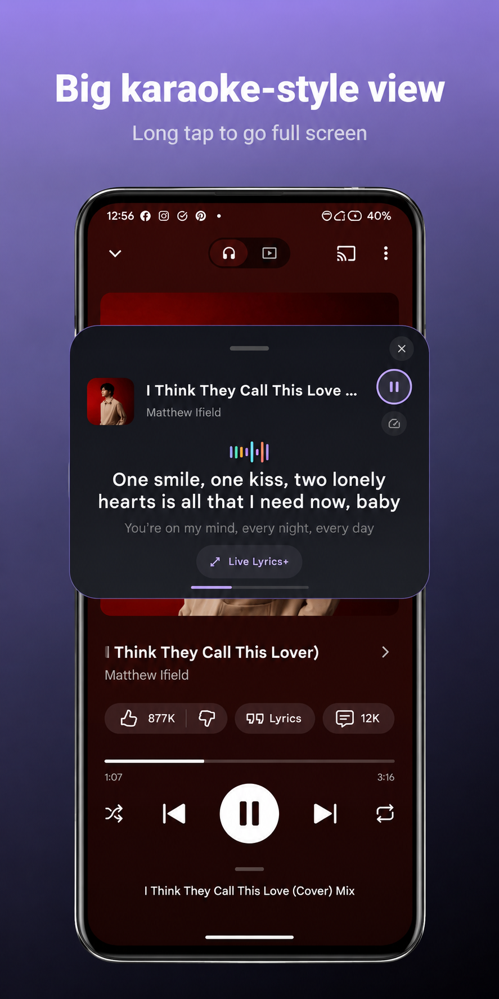
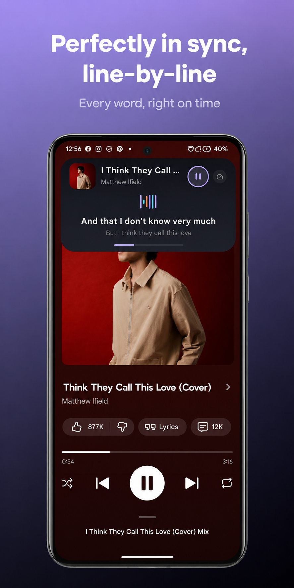
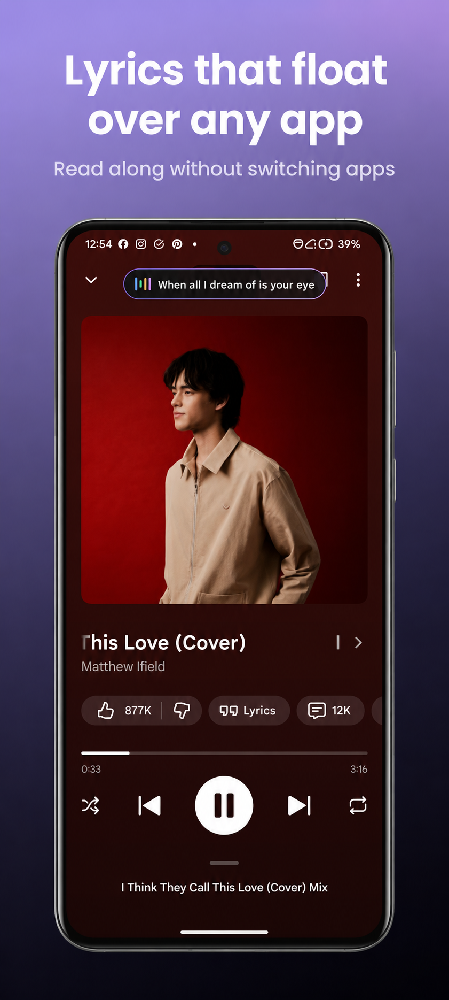
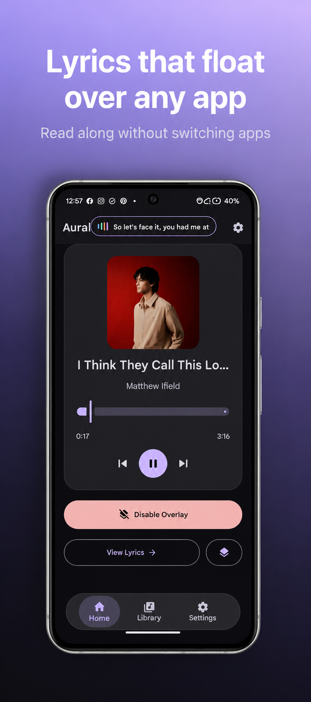

# 🎵 AURALIS

 

---

## 🎧 What is Auralis?

Play a song in almost any music player and Auralis detects it, fetches the matching **time-synced lyrics**, and shows them in a sleek **floating pill** that lives above your other apps. Tap to expand it into a full card, and the lyrics scroll line-by-line, perfectly in step with the music.

No account. No ads. Just lyrics, everywhere.

## ✨ Features

<table>
<tr>
<td width="50%" valign="top">

**🎤 Live, time-synced lyrics**
Scroll in real time with the song.

**🫧 Floats over any app**
A draggable pill that hovers above your other apps, with a foreground service keeping it alive while you play.

**🃏 Pill or big card**
Two overlay sizes to start in — a compact pill or a big draggable card — plus a tap-to-expand bar for a quick glance without going full-screen.

**🔦 Line-by-line highlighting**
Always know exactly where you are.

</td>
<td width="50%" valign="top">

**⏱️ Per-song sync memory**
Nudge the timing (Sync) or scroll speed (Pace) once — Auralis remembers it per track.

**🎨 Fully customizable**
Background, text, and accent colors with a live preview while you pick, plus size, corner roundness, and position.

**⏯️ Quick controls**
Play, pause, next, previous, and fine sync adjustment from the pill itself.

**📄 Bring your own lyrics**
Import a `.lrc` or `.txt` for any track the sources can't find.

</td>
</tr>
</table>

## 🔎 The lyrics engine

Auralis doesn't rely on a single provider. When a song starts, it queries **LrcLib, KuGou, and NetEase** in parallel for time-synced lyrics, and keeps whichever result's duration lines up best with the actual track. If nothing synced turns up, it falls back to **Lyrics.ovh** for plain text. iTunes is queried separately, purely to fill in a track duration when the player doesn't report one, so matching stays accurate. Results are cached on-device so a song you've already looked up never needs a re-fetch.

## 🔐 Privacy

Auralis needs two one-time permissions:

| Permission | Why |
|---|---|
| **Notification access** | Used *only* to detect the currently playing song (title + artist) to look up matching lyrics. Auralis never reads your personal notifications. |
| **Display over other apps** | So the lyrics overlay can float on top. |

Only the song title and artist ever leave your device — to fetch lyrics from the sources above. Auralis also sends anonymous, non-identifying usage analytics (feature counts, lyric-match status, source name) to help fix bugs — never lyric text, song titles, or artist names. Auralis collects no personal information and never sells your data.

## 📱 Screenshots

   

## 📲 Get it

Requires Android 8.0 (Oreo) or newer.

## 🛠 Under the hood

| | |
|---|---|
| Language | Kotlin |
| UI | Jetpack Compose, Material 3 (Expressive-styled) |
| DI | Hilt |
| Data | Room, DataStore |
| Networking | Retrofit + Gson |
| Background | Foreground service (media playback) |
| Min / target / compile SDK | 26 / 36 / 36 |

## 💬 Feedback

Found a bug or have a feature idea? Use **Settings → Help & Support → Send feedback** in the app.

## 💖 Support

If Auralis is useful to you, sharing it with a friend goes a long way for a one-person project.

### ☕ Buy Me a Coffee

Hey! 👋 I'm Nikhil, an indie Android developer building this project in my free time — lyrics that float over whatever you're already using, without a login or a subscription.

Every contribution goes directly toward new features, bug fixes, performance improvements, and long-term development.

*Thank you for supporting independent development ❤️*

---

*Made by Vythera.*

[⬆ Back to top](#top)

